# 2020年全国卷高考化学试卷

# 2020年全国统一高考化学试卷（新课标Ⅰ）

参考答案与试题解析

## 一、选择题：本题共 7小题，每小题 6分，共 42分。在每小题给出的四个选项中，只有一项是符合题目要求的。

1．（6分）国家卫健委公布的新型冠状病毒肺炎诊疗方案指出，乙醚、 $7 5 \% Z$ 醇、含氯消毒剂、过氧乙酸 $\mathrm { ( C H _ { 3 } C O O O H ) }$ ）、氯仿等均可有效灭活病毒。对于上述化学药品，下列说法错误的是（　　）A $\mathrm { C H } _ { 3 } \mathrm { C H } _ { 2 } \mathrm { O H }$ 能与水互溶B $\mathrm { N a C l O }$ 通过氧化灭活病毒C．过氧乙酸相对分子质量为76D．氯仿的化学名称是四氯化碳

【分析】A $\mathrm { C H } _ { 3 } \mathrm { C H } _ { 2 } \mathrm { O H }$ 与水分子间能形成氢键，并且都是极性分子；B $\mathrm { N a C l O }$ 具有强氧化性；C．过氧乙酸的结构简式为 $\mathrm { C H _ { 3 } C O O H }$ D．氯仿的化学名称是三氯甲烷。

【解答】解： $\mathrm { A } . \mathrm { C H } _ { 3 } \mathrm { C H } _ { 2 } \mathrm { O H }$ 与水分子间能形成氢键，并且都是极性分子，所以 $\mathrm { C H } _ { 3 } \mathrm { C H } _ { 2 } \mathrm { O H }$ 能与水以任意比互溶，故A正确；  
B．NaClO具有强氧化性，通过氧化能灭活病毒，故B正确；  
C．过氧乙酸的结构简式为 $\mathrm { C H _ { 3 } C O O H }$ ，相对分子质量为 $1 2 \times 2 + 4 + 1 6 \times 3 = 7 6$ ，故C正确；  
D．氯仿的化学名称是三氯甲烷，不是四氯化碳，故D错误；  
故选：D。

【点评】本题结合时事热点考查化学问题，平时要注意积累，题目难度不大。

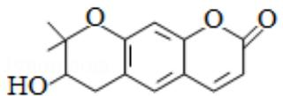

2．（6分）紫花前胡醇（ ）可从中药材当归和白芷中提取得到，能提高人体免疫力。有关该化合物，下列叙述错误的是（　　）A．分子式为 $\mathrm { C _ { 1 4 } H _ { 1 4 } O _ { 4 } }$ B．不能使酸性重铬酸钾溶液变色

C．能够发生水解反应D．能够发生消去反应生成双键

【分析】A、分子中14个碳原子，不饱和度为8；  
B、分子中含有碳碳双键和羟基直接相连碳上有氢原子；  
C、分子中含有酯基，能发生水解；  
D、与﹣OH 相连的C 的邻位C上有一种H 可发生消去反应；【解答】解：A、分子的不饱和度为 8，则氢原子个数为： $1 4 \times 2 + 2 \textmd { - } 8 \times 2 = 1 4$ ，四个氧原子，所以分子式为： $\mathrm { C _ { 1 4 } H _ { 1 4 } O _ { 4 } }$ ，故A正确；  
B、分子中含有碳碳双键和羟基直接相连碳上有氢原子，所以能使酸性重铬酸钾溶液变色，故B错误；  
C、分子中含有能发生水解酯基，则紫花前胡醇能水解，故C正确；  
D、与﹣OH 相连的C 的邻位C上有一种H 可发生消去反应，生成双键，故D正确；故选：B。

【点评】本题考查有机物的结构与性质，为高频考点，把握醇消去反应的结构特点为解答的关键，侧重醇性质的考查，题目难度不大。

3．（6分）下列气体去除杂质的方法中，不能实现目的的是（　　）

<table><tr><td rowspan=1 colspan=1></td><td rowspan=1 colspan=1>气体（杂质）</td><td rowspan=1 colspan=1>方法</td></tr><tr><td rowspan=1 colspan=1>A.</td><td rowspan=1 colspan=1> $\mathrm { S O } _ { 2 } \ \mathrm { ( H } _ { 2 } \mathrm { S ) }$ </td><td rowspan=1 colspan=1>通过酸性高锰酸钾溶液</td></tr><tr><td rowspan=1 colspan=1>B.</td><td rowspan=1 colspan=1> ${ \mathrm { C l } } _ { 2 } \ \mathrm { ( H C l ) }$ </td><td rowspan=1 colspan=1>通过饱和的食盐水</td></tr><tr><td rowspan=1 colspan=1>C.</td><td rowspan=1 colspan=1> ${ \bf N } _ { 2 } \ { \bf \Gamma } ( { \bf O } _ { 2 } )$ </td><td rowspan=1 colspan=1>通过灼热的铜丝网</td></tr><tr><td rowspan=1 colspan=1>D.</td><td rowspan=1 colspan=1> $\mathrm { N O } \ \mathrm { ~ ( N O } _ { 2 } )$ </td><td rowspan=1 colspan=1>通过氢氧化钠溶液</td></tr></table>

A．A B．B C．C D．D

【分析】除杂的原则是不引入新的杂质，不减少要提纯的物质，操作简单，绿色环保。A． ${ \mathrm { S O } } _ { 2 }$ 具有还原性，易被酸性高锰酸钾溶液氧化为硫酸；B．饱和食盐水可以减少氯气的溶解量；

C ${ \bf N } _ { 2 } \ { \bf \Gamma } ( { \bf O } _ { 2 } )$ 利用化学性质的差异，铜与氧气反应，；  
D. $2 \mathrm { N O } _ { 2 } + 2 \mathrm { N a O H } { = } \mathrm { N a N O } _ { 2 } { + } \mathrm { N a N O } _ { 3 } { + } \mathrm { H } _ { 2 } \mathrm { O }$ ，NO 为不成盐氧化物，  
【解答】解：A ${ \mathrm { S O } } _ { 2 }$ 被酸性高锰酸钾溶液氧化为硫酸，故A错误；  
B． $\mathrm { C l } _ { 2 }$ （HCl）利用溶解性的差异，除去HCl，故B正确；  
C ${ \bf N } _ { 2 } \ { \bf \Gamma } ( { \bf O } _ { 2 } )$ 利用化学性质的差异，铜与氧气反应，不与氮气反应，达到除杂目的，故C正确；  
D． $\Nu { 0 } _ { 2 }$ 可以与NaOH发生反应： $2 \mathrm { N O } _ { 2 } + 2 \mathrm { N a O H } { = } \mathrm { N a N O } _ { 2 } { + } \mathrm { N a N O } _ { 3 } { + } \mathrm { H } _ { 2 } \mathrm { O }$ ，NO 与 NaOH 溶液不能发生反应；尽管 NO 可以与 $\mathrm { N O } _ { 2 }$ 一同跟 NaOH 发生反应： $\mathrm { N O + N O } _ { 2 } \mathrm { + } 2 \mathrm { N a O H - }$ $2 \mathrm { N a N O } _ { 3 } \mathrm { + H } _ { 2 } \mathrm { O }$ ，但由于杂质的含量一般较少，所以也不会对 NO 的量产生较大的影响，故D正确；  
故选：A。

【点评】本题考查了气体除杂质，要掌握各物质的性质，难度不大，注重基础。

4．（6 分）铑的配合物离子 $\mathrm { ( R h ~ ( C O ) ~ \Omega _ { 2 } I _ { 2 } ] }$ ﹣可催化甲醇羰基化，反应过程如图所示。下列叙述错误的是（　　）

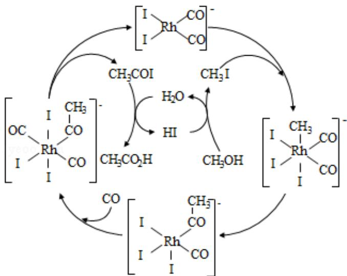

A $\mathrm { C H } _ { 3 } \mathrm { C O I }$ 是反应中间体B．甲醇羰基化反应为 $\mathrm { C H _ { 3 } O H + C O = C H _ { 3 } C O _ { 2 } H }$ C．反应过程中Rh 的成键数目保持不变D．存在反应 $\mathrm { C H _ { 3 } O H + H I { = } C H _ { 3 } I + H _ { 2 } O }$

【分析】A、由图可知，铑的配合物离子 $\mathbf { \left( R h \Phi ( C O ) \Phi _ { 2 } I _ { 2 } \right]} $ ﹣生成 $\mathrm { C H } _ { 3 } \mathrm { C O I }$ $\mathrm { C H } _ { 3 } \mathrm { C O I }$ 继续与 $\mathrm { H } _ { 2 } \mathrm { O }$ 反应生成 HI 和 $\mathrm { C H } _ { 3 } \mathrm { C O } _ { 2 } \mathrm { I }$ H；

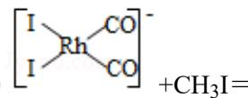

coI coB、由图可知发生的反应依次为： $\textcircled { 1 } \mathrm { C H } _ { 3 } \mathrm { O H } \mathrm { + H I } \mathrm { - C H } _ { 3 } \mathrm { I } \mathrm { + H } _ { 2 } \mathrm { O }$ ，② +CH3I＝

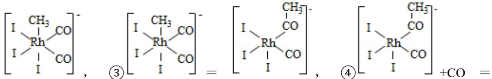

$$
\textcircled { 6 } \mathrm { { C H } _ { 3 } \mathrm { { C O I } + H _ { 2 } O \ = \ } }
$$

$_ \mathrm { H I + C H _ { 3 } C O _ { 2 } H }$ ，6个反应依次发生；

C、由图可以看出Rh 的成键数目由 $4 - 6 - 5 - 6 - 4$ 变化；

D、由B分析及图中箭头方向判断出此步反应。

【解答】解：A、由图可知，铑的配合物离子 $\mathrm { ( R h ~ ( C O ) ~ } _ { 2 } \mathrm { I } _ { 2 } \mathrm { I } ^ { - }$ 生成 $\mathrm { C H _ { 3 } C O I } , \mathrm { C H _ { 3 } C O I }$ 继续与 $\mathrm { H } _ { 2 } \mathrm { O }$ 反应生成HI 和 $\mathrm { C H } _ { 3 } \mathrm { C O } _ { 2 } \mathrm { H }$ ，所以 $\mathrm { C H } _ { 3 } \mathrm { C O I }$ 是反应中间体，故A正确；

coRhI CoB、由图可知发生的反应依次为： $\textcircled { 1 } \mathrm { C H } _ { 3 } \mathrm { O H } \mathrm { + H I } \mathrm { - C H } _ { 3 } \mathrm { I } \mathrm { + H } _ { 2 } \mathrm { O }$ ，② +CH3I＝

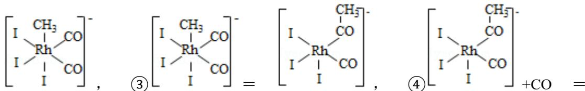

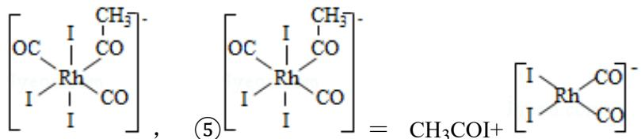

$$
\begin{array} { r l } { \widehat { \bf ( 6 ) } \mathrm { C H } _ { 3 } \mathrm { C O I } \mathrm { + H } _ { 2 } \mathrm { O } } & { { } = } \end{array}
$$

$_ \mathrm { H I + C H _ { 3 } C O _ { 2 } H }$ ，6个反应依次发生，6个反应方程式相加和，消去中间产物得出总反应：$\mathrm { C H _ { 3 } O H + C O = C H _ { 3 } C O _ { 2 } H }$ ，故B 正确；

C、由图可以看出Rh 的成键数目由4变为6再变为5再变为6再变为4，依次循环，故C 错误；

D、由B 分析，按照箭头方向可知： $\mathrm { C H } _ { 3 } \mathrm { O H }$ 和HI反应生成 $\mathrm { C H } _ { 3 } \mathrm { I }$ 和 $\mathrm { H } _ { 2 } \mathrm { O }$ ，反应方程式为：即 $\mathrm { C H _ { 3 } O H + H I = C H _ { 3 } I + H _ { 2 } O }$ ，故 D 正确；

故选：C。

【点评】本题考查学生对有机化学基础的理解和掌握，题目难度中等，掌握反应类型、化学反应原理等，明确由化学反应是解题关键。同时也考查了学生阅读题目获取新信息的能力，需要学生具备扎实的基础与综合运用知识、信息分析解决问题能力。

5．（6分）1934年约里奥﹣居里夫妇在核反应中用α粒子（即氦核 $_ 2 ^ { 4 } \mathrm { H e } )$ 轰击金属原子 $_ \texttt { z } ^ { \mathbb { V } }$ 得到核素 $^ { 3 0 } _ {  { \mathbb { Z } } + 2 }  { \mathrm { Y } }$ ，开创了人造放射性核素的先河： $\frac { \mathbb { W } } { \mathbb { Z } } \mathrm { X } + \frac { 4 } { 2 } \mathrm { H e } \mathrm { \to } \frac { 3 0 } { \mathbb { Z } \mathrm { + } 2 } \mathrm { Y } + \frac { 1 } { \mathbb { I } } \mathrm { n }$ 其中元素 X、Y 的最外层电子数之和为8．下列叙述正确的是（　　）A． $_ \texttt { Z } ^ { \Psi \mathrm { X } }$ 的相对原子质量为26B．X、Y 均可形成三氯化物C．X的原子半径小于Y 的D．Y仅有一种含氧酸

【分析】由 $\frac { \mathbb { W } } { \mathbb { Z } } \mathrm { X } + \frac { 4 } { 2 } \mathrm { H e } \mathrm { \to } \frac { 3 \mathbb { I } } { \mathbb { Z } \mathrm { + } 2 } \mathrm { Y } + \frac { 1 } { \mathbb { I } } \mathrm { n }$ 及质量守恒可知， $\mathrm { W } { = } 3 0 { + } 1 - 4 { = } 2 7$ ，X、Y 的最外层电子数之和为 8，X 的最外层电子数为 $\scriptstyle { \frac { 8 - 2 } { 2 } } = 3$ ，金属原子 $_ \texttt { Z } ^ { \Psi \mathrm { X } }$ 的质量数为 27、且位于ⅢA族，Z＝13符合题意，则X 为Al；Y的最外层电子数为 $8 - 3 = 5$ ，质子数为 $1 3 + 2 = 1 5$ Y为P，以此来解答。

【解答】解：由上述分析可知X为Al、Y为P，A．W为27，X原子的相对原子质量为27，故A错误；B．X、Y 可形成三氯化物分别为 $\mathrm { A l C l } _ { 3 } , \ \mathrm { P C l } _ { 3 }$ ，故 B 正确；C．同周期从左向右原子半径减小，则X的原子半径大于Y的半径，故C错误；D．Y的含氧酸有磷酸、偏磷酸等，故D 错误；

故选：B。

【点评】本题考查原子结构与元素周期律，为高频考点，把握最外层电子数、质量守恒来推断元素为解答的关键，同时侧重分析与应用能力的考查，注意规律性知识的应用，题目难度不大。

6．（6 分）科学家近年发明了一种新型 $Z { \mathrm { n } } - { \mathrm { C O } } _ { 2 }$ 水介质电池。电池示意图如图，电极为金属锌和选择性催化材料。放电时，温室气体 $\mathrm { C O } _ { 2 }$ 被转化为储氢物质甲酸等，为解决环境和能源问题提供了一种新途径。下列说法错误的是（　　）

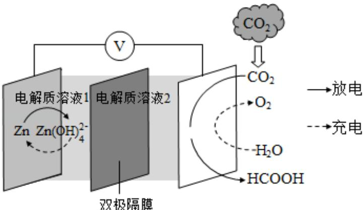

A．放电时，负极反应为 $\mathrm { Z n } - 2 \mathbf { e } ^ { \mathrm { - } } { + } 4 \mathrm { O H } ^ { \mathrm { - } } { - } \mathrm { Z n } \mathrm { ~ ( O H ) ~ } \mathrm { \ } _ { 4 } ^ { 2 }$ B．放电时， $\mathrm { 1 m o l } \mathrm { C O } _ { 2 }$ 转化为HCOOH，转移的电子数为2molC．充电时，电池总反应为 $2 Z { \mathsf { n } } { \mathsf { \Pi } } ( { \mathrm { O H } } ) { \mathsf { \Pi } } _ { 4 } ^ { 2 } - 2 Z { \mathsf { n } } + { \mathrm { O } } _ { 2 } \uparrow + 4 { \mathrm { O H } } ^ { - } + 2 { \mathrm { H } } _ { 2 } { \mathrm { O } }$ D．充电时，正极溶液中OH﹣浓度升高

【分析】电极为金属锌放电时，由图示知负极反应为 $\mathrm { Z n } - 2 \mathbf { e } ^ { \mathrm { - } } { + } 4 \mathrm { O H } ^ { \mathrm { - } } { - } \mathrm { Z n } \mathrm { ~ ( O H ) ~ } _ { 4 } \mathrm { } ^ { 2 } +$ 温室气体 $\mathrm { C O } _ { 2 }$ 被转化为储氢物质甲酸为还原反应，充电时阳极生成氧气，阴极发生还原反应生成锌，据此答题。  
【解答】解：A．放电时，金属锌做负极生成 $Z _ { \bf n } ~ \left( \mathrm { O H } \right) _ { 4 } { } ^ { 2 . }$ ，负极反应为 $\mathrm { Z n } - 2 \mathrm { e } ^ { - } + 4 \mathrm { O H } ^ { - } =$ $\mathrm { Z n ~ ( O H ) } ~ _ { 4 } { } ^ { 2 \cdot }$ ，故 A正确；  
B．放电时， $\mathrm { C O } _ { 2 }$ 中碳的化合价为+4 价，HCOOH 中碳的化合价+2， $\mathrm { 1 m o l } \mathrm { C O } _ { 2 }$ 转化为HCOOH，降低2价，转移的电子数为2mol，故B正确；  
C．充电时，阳极电极反应： $2 \mathrm { H } _ { 2 } \mathrm { O } \mathrm { ~ - ~ } 4 \mathrm { e } ^ { \mathrm { - } } = 4 \mathrm { H } ^ { \mathrm { + } } \mathrm { + } \mathrm { O } _ { 2 } \uparrow$ ，阴极反应： $\mathrm { Z n ~ ( O H ) ~ } _ { 4 } \mathrm { { } ^ { 2 \cdot } \mathrm { - \mathrm { Z n } \cdot \mathrm { - } } }$ $2 \mathbf { e } ^ { - } + 4 \mathrm { O H } ^ { - }$ ，电池总反应为 $2 Z { \mathsf { n } } \ { \mathrm { ~ ( O H ) ~ } } _ { 4 } { } ^ { 2 } { \mathrm { - } } 2 Z { \mathsf { n } } { \mathrm { + O } } _ { 2 } \uparrow + 4 { \mathrm { O H } } ^ { - } + 2 { \mathrm { H } } _ { 2 } { \mathrm { O } }$ ，故C正确；D．充电时，阳极（原电池的正极）电极反应： $2 \mathrm { H } _ { 2 } \mathrm { O } \cdot 4 \mathrm { e } ^ { - } = 4 \mathrm { H } ^ { + } \mathrm { + } \mathrm { O } _ { 2 } \uparrow$ ↑，溶液中H+浓度增大，溶液中 ${ \bf c } ~ ( \mathrm { H ^ { + } } ) { \bullet } { \bf c } ~ ( \mathrm { O H ^ { - } } ) = { \bf K } _ { \mathrm { W } }$ ，温度不变时， $\mathrm { K } _ { \mathrm { W } }$ 不变，因此溶液中OH﹣浓度降低，故D 错误；  
故选

故选：D。

【点评】本题考查原电池原理、电解池原理、电极方程式的书写、离子电子的转移等知识点，是高频考点，难度中等，注重基础。

7．（6 分）以酚酞为指示剂，用 0.1000mol•L﹣1 的 NaOH 溶液滴定 20.00mL 未知浓度的二元酸 $\mathrm { H } _ { 2 } \mathrm { A }$ 溶液。溶液中，pH、分布系数δ随滴加 NaOH 溶液体积 $\mathrm { \Delta V _ { N a O H } }$ 的变化关系如图所示。[比如 $\mathsf { A } ^ { 2 \mathrm { ~ - ~ } }$ 的分布系数： $\delta ( \mathbf { A } ^ { 2 - } ) = \frac { \mathsf { c } ( \mathsf { A } ^ { 2 - } ) } { \mathsf { c } ( \mathsf { H } _ { 2 } \mathsf { A } ) + \mathsf { c } ( \mathsf { H } \mathsf { A } ^ { - } ) + \mathsf { c } ( \mathsf { A } ^ { 2 - } ) } ]$

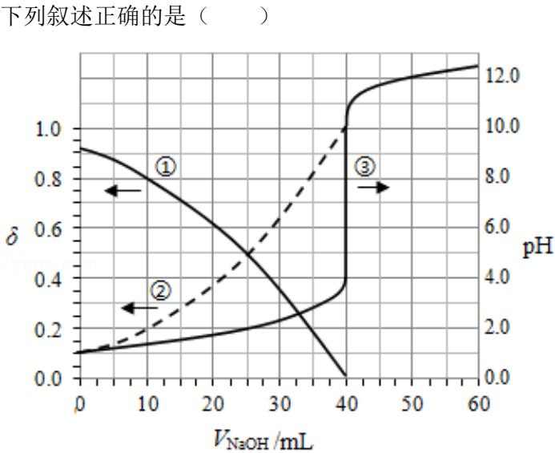

A．曲线①代表 $\begin{array} { r l } { \delta } & { { } ( \operatorname { H } _ { 2 } \mathbf { A } ) } \end{array}$ ，曲线②代表δ（HA﹣）  
B． $\mathrm { H } _ { 2 } \mathrm { A }$ 溶液的浓度为 $0 . 2 0 0 0 \mathrm { m o l } { \cdot } \mathrm { L } ^ { - 1 }$   
C．HA﹣的电离常数 $\mathrm { K } _ { \mathrm { a } } { = } 1 . 0 { \times } 1 0 ^ { - 2 }$   
D．滴定终点时，溶液中 $\mathrm { ~ c ~ } ~ ( \mathrm { N a ^ { + } } ) ~ { < } 2 \mathrm { c } ~ ( \mathrm { A } ^ { 2 \cdot } ) { + } \mathrm { c } ~ ( \mathrm { H A ^ { - } } )$ B、溶液的pH发生突变时，滴有酚酞的溶液发生颜色变化，到达滴定终点，即NaOH和$\mathrm { H } _ { 2 } \mathrm { A }$ 恰好完全反应；  
C、HA﹣的电离常数 $\mathrm { K _ { a } } \mathrm { = } \frac { \mathsf { c } ( \mathrm { H } ^ { + } ) \mathsf { c } ( \mathrm { A } ^ { 2 - } ) } { \mathsf { c } ( \mathrm { H A } ^ { - } ) }$

$$
\mathrm { \small ~ c ~ } \left( \mathrm { H } ^ { + } \right) + _ { \bf c } \left( \mathrm { N } { \bf a } ^ { + } \right) = 2 \mathrm { c } \left( { \bf A } ^ { 2 \cdot } \right) + _ { \bf c }
$$

【解答】解：A、在未加NaOH溶液时，曲线①的分布系数与曲线②的分布系数之和等  
于1，且δ曲线①一直在减小，曲线②在一直增加；说明 $\mathrm { H } _ { 2 } \mathrm { A }$ 第一步完全电离，第二步  
存在电离平衡，即 $\mathrm { H } _ { 2 } \mathrm { A } { = } \mathrm { H } \mathrm { A } ^ { - } { + } \mathrm { H } ^ { + }$ $\mathrm { H } \mathbf { A } ^ { - }  \mathbf { A } ^ { 2 - } + \mathrm { H } ^ { + }$ ，曲线①代表 $\begin{array} { r l } { { 8 } } & { { } ( \mathrm { H A ^ { - } \ } ) ; } \end{array}$ 当加入用  
$0 . 1 0 0 0 \mathrm { m o l } { \cdot } \mathrm { L } ^ { - 1 }$ 的 NaOH 溶液 40.00mL 滴定后，发生 $\mathrm { N a H A + N a O H { = } N a _ { 2 } A + H _ { 2 } O }$ ，HA﹣的  
分布系数减小， $\mathrm { A } ^ { 2 }$ ﹣的分布系数在增大，且曲线②在一直在增加，在滴定终点后与③重  
合，所以曲线②代表 $\begin{array} { r l } { \delta } & { { } ( \mathbf { A } ^ { 2 - } ) } \end{array}$ ），故A错误；  
B、当加入40.00mLNaOH溶液时，溶液的pH发生突变，到达滴定终点，说明NaOH和  
$\mathrm { H } _ { 2 } \mathrm { A }$ 恰好完全反应，根据反应 $2 \mathrm { N a O H ^ { + } H _ { 2 } A = N a _ { 2 } A + 2 H _ { 2 } O , \Delta \ n \ ( N a O H ) \ = 2 n \ ( H _ { 2 } A ) , }$ c$\mathrm { ( H _ { 2 } A ) \ { = } { \frac { 0 . 1 0 0 0 m o 1 / L \times 4 0 m L } { 2 \times 2 0 . 0 0 \mathrm { m L } } } { = } 0 . 1 0 0 0 m o l / L }$ ，故B错误；

C、由于 $\mathrm { H } _ { 2 } \mathrm { A }$ 第一步完全电离，则 HA﹣的起始浓度为0.1000mol/L，根据图象，当 $\mathrm { { V _ { N a O H } } = }$ 0时，HA﹣的分布系数为0.9，溶液的 $\mathrm {  ~ \ p H } { = } 1 , ~ \mathrm {  ~ \mathsf { A } } ^ { 2 - }$ 的分布系数为0.1，则HA﹣的电离平衡常数 $\mathrm { K _ { a } } = \frac { \odot \left( \mathbb { A } ^ { 2 - } \right) * _ { C } ( \mathrm { H } ^ { + } ) } { \mathrm { c ( H A } ^ { - } ) } = \frac { 0 . 1 0 0 0 \mathrm { m o 1 } / \mathrm { L } \times 0 . 1 \times 0 . 1 0 0 0 \mathrm { m o 1 } / \mathrm { L } _ { \infty 1 } \times 1 0 ^ { - 2 } } { 0 . 1 0 0 0 \mathrm { m o 1 } / \mathrm { L } \times 0 . 9 } \approx 1 \times 1 0 ^ { - 2 }$ ，故C正

确；

D、用酚酞作指示剂，酚酞变色的pH范围为8.2～10，终点时溶液呈碱性， $\mathrm { { \textbf { c } } \left( O H ^ { - } \right) > }$ $\mathrm { ~ c ~ } \left( \mathrm { H } ^ { + } \right)$ ），溶液中的电荷守恒， $\mathrm { ~ c ~ } \left( \mathrm { H } ^ { + } \right) + \mathrm { c } \left( \mathrm { N } \mathrm { a } ^ { + } \right) = 2 \mathrm { c } \left( \mathrm { A } ^ { 2 - } \right) + \mathrm { c } \left( \mathrm { O H } ^ { - } \right) + \mathrm { c } \left( \mathrm { H A } ^ { - } \right)$ ），则$\mathrm { ~ c ~ } ~ ( \mathrm { N a ^ { + } } ) ~ { > } 2 \mathrm { c } ~ ( \mathrm { A } ^ { 2 \cdot } ) ~ + \mathrm { c } ~ ( \mathrm { H A ^ { - } } )$ ），故D错误；

故选：C。

【点评】本题考查学生对酸碱混合时的定性判断和 $\mathsf { p H }$ 的理解和掌握，以及阅读题目获取新信息能力等，熟练掌握电离平衡、水解平衡的的影响原理等，需要学生具备扎实的基础与综合运用知识、信息分析解决问题能力，题目难度中等。明确曲线①②③是解题关键。

## 二、非选择题：共 58 分。第 8～10 题为必考题，每个试题考生都必须作答。第 11～12 题为选考题，考生根据要求作答。（一）必考题：共 43分。

8．（14分）钒具有广泛用途。黏土钒矿中，钒以+3、+4、+5价的化合物存在，还包括钾、镁的铝硅酸盐，以及 $\mathrm { S i O } _ { 2 } , \ \mathrm { F e } _ { 3 } \mathrm { O } _ { 4 }$ ．采用以下工艺流程可由黏土钒矿制备 $\mathrm { N H } _ { 4 } \mathrm { V O } _ { 3 }$

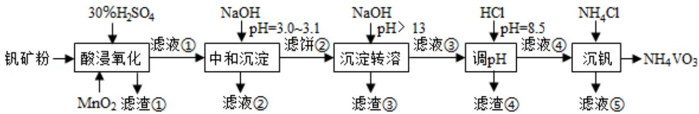

该工艺条件下，溶液中金属离子开始沉淀和完全沉淀的pH如下表所示：

<table><tr><td rowspan=1 colspan=1>金属离子</td><td rowspan=1 colspan=1> $\mathrm { F e } ^ { 3 + }$ </td><td rowspan=1 colspan=1> $\mathrm { F e } ^ { 2 + }$ </td><td rowspan=1 colspan=1> $\mathsf { A l } ^ { 3 + }$ </td><td rowspan=1 colspan=1> $\mathrm { M n } ^ { 2 + }$ </td></tr><tr><td rowspan=1 colspan=1>开始沉淀 $\mathsf { p H }$ </td><td rowspan=1 colspan=1>1.9</td><td rowspan=1 colspan=1>7.0</td><td rowspan=1 colspan=1>3.0</td><td rowspan=1 colspan=1>8.1</td></tr><tr><td rowspan=1 colspan=1>完全沉淀 $\mathsf { p H }$ </td><td rowspan=1 colspan=1>3.2</td><td rowspan=1 colspan=1>9.0</td><td rowspan=1 colspan=1>4.7</td><td rowspan=1 colspan=1>10.1</td></tr></table>

回答下列问题：

（1）“酸浸氧化”需要加热，其原因是　加快酸浸和氧化反应速率　。

（2）“酸浸氧化”中， $\mathrm { V O ^ { + } }$ 和 $\mathrm { V O } ^ { 2 + }$ 被氧化成 ${ \mathrm { V O } } _ { 2 } { } ^ { + }$ ，同时还有 $\mathrm { F e } ^ { 2 + }$ 离子被氧化。写出$\mathrm { V O ^ { + } }$ 转化为 $\mathrm { V O } _ { 2 } \mathrm { \bar { \Gamma } }$ +反应的离子方程式 $\mathrm { V O ^ { + } }  + 2 \mathrm { H ^ { + } } { + } \mathrm { M n O } _ { 2 } { = } \mathrm { V O _ { 2 } } ^ { + } { + } \mathrm { M n } ^ { 2 + } { + } \mathrm { H } _ { 2 } \mathrm { O }$

（3）“中和沉淀”中，钒水解并沉淀为 ${ \mathrm { V } } _ { 2 } { \mathrm { O } } _ { 5 } { \cdot } { \mathrm { x H } } _ { 2 } { \mathrm { O } }$ ，随滤液 $\textcircled{2}$ 可除去金属离子 $\mathrm { K } ^ { + }$

$\mathrm { M g } ^ { 2 + }$ $\mathrm { N a ^ { + } }$ $\mathrm { M n } ^ { 2 + }$ ，以及部分的　Al3+和 $\mathrm { F e } ^ { 3 + }$

（4）“沉淀转溶”中， ${ \mathrm { V } } _ { 2 } { \mathrm { O } } _ { 5 } { \bullet } { \mathrm { x H } } _ { 2 } { \mathrm { O } }$ 转化为钒酸盐溶解。滤渣③的主要成分是　Fe（OH）3　。

（5）“调 $\mathrm { p H } ^ { \prime \prime }$ 中有沉淀生成，生成沉淀反应的化学方程式是 $\mathrm { H C l + N a A l ~ ( O H ) \_ 4 = A l }$ $( \mathrm { O H } ) _ { 3 } \downarrow + \mathrm { N a C l } + \mathrm { H } _ { 2 } \mathrm { O }$

（6）“沉钒”中析出 $\mathrm { N H } _ { 4 } \mathrm { V O } _ { 3 }$ 晶体时，需要加入过量 $\mathrm { N H } _ { 4 } \mathrm { C l }$ ，其原因是　利用同离子效应，促进 $\mathrm { N H } _ { 4 } \mathrm { V O } _ { 3 }$ 尽可能析出完全　。

【分析】黏土钒矿中，钒以+3、+4、+5价的化合物存在，还包括钾、镁的铝硅酸盐，以及 $\mathrm { S i O } _ { 2 } \setminus \mathrm { F e } _ { 3 } \mathrm { O } _ { 4 }$ ，加入稀硫酸，使 $\mathrm { F e } _ { 3 } \mathrm { O } _ { 4 }$ 生成 $\mathrm { F e } ^ { 3 + }$ 和 $\mathrm { F e } ^ { 2 + }$ ；加入 $\mathbf { M n O } _ { 2 }$ 氧化还原性的 $\mathrm { F e } ^ { 2 + }$ 成 $\mathrm { F e } ^ { 3 + }$ $\mathrm { V O ^ { + } }$ 和 $\mathrm { V O } ^ { 2 + }$ 成 ${ \mathrm { V O } } _ { 2 } { } ^ { + }$ $\mathrm { S i O } _ { 2 }$ 和硅酸盐与酸生成的硅酸成为滤渣①，滤液①含有：$\mathrm { F e } ^ { 3 + }$ ${ \mathrm { V O } } _ { 2 } { } ^ { + }$ 、K+、 $\mathrm { M g } ^ { 2 + }$ $\mathrm { N a ^ { + } }$ $\mathrm { M n } ^ { 2 + }$ $\mathsf { A l } ^ { 3 + }$ ；滤液①加入 NaOH 溶液至 $\mathrm { p H } { = } 3 . 0 { \sim } 3 . 1$ 中和过量的硫酸并沉淀 $\mathrm { F e } ^ { 3 + }$ ，使钒水解并沉淀为 ${ \mathrm { V } } _ { 2 } { \mathrm { O } } _ { 5 } { \cdot } { \mathrm { x H } } _ { 2 } { \mathrm { O } }$ ，得滤饼 $\textcircled{2}$ ，除去滤液② $\mathrm { M n } ^ { 2 + }$ $\mathrm { K } ^ { + }$ $\mathrm { M g } ^ { 2 + }$ $\mathrm { N a ^ { + } }$ 及部分 $\mathrm { F e } ^ { 3 + }$ $\mathrm { A l } ^ { 3 + }$ ；滤饼②加入过量 NaOH 溶液至 $\mathsf { p H } { \geq } 1 3$ 沉淀转溶得滤液③，滤液③含有 ${ \mathrm { V } } _ { 2 } { \mathrm { O } } _ { 5 } { \cdot } { \mathrm { x H } } _ { 2 } { \mathrm { O } }$ 生成 $\mathrm { V O } _ { 3 }$ ﹣和溶于碱的 Al（OH）3生成的Al（OH）4﹣；滤渣③为 Fe（OH）3，滤液 $\textcircled{3}$ 加入盐酸调 $\mathsf { p H }$ ，Al（OH）4﹣生成 Al$( \mathrm { O H } ) _ { 3 }$ 即滤渣④；滤液④含有 $\mathrm { V O } _ { 3 }$ ﹣，加入 $\mathrm { N H } _ { 4 } \mathrm { C l }$ 沉钒的产物： $\mathrm { N H } _ { 4 } \mathrm { V O } _ { 3 } ;$ 和滤液 $\textcircled{5} \mathrm { N a C l }$ 溶液；

（1）升高温度，反应速率加快；

（2）加入氧化性物质可除去具有还原性的离子；依据电子转移守恒和元素守恒写出离子方程式；

（3）根据某些离子沉淀的pH，找出相应沉淀的离子；

（4） $\mathrm { F e } ^ { 3 + }$ 溶液呈强碱性时转化为 Fe（OH）3；

（5）加入酸沉淀离子Al（OH）4﹣生成 $\mathrm { { A l ~ ( O H ) } } _ { \ 3 } ;$

（6） $\mathrm { N H } _ { 4 } \mathrm { C l }$ 溶于水电离出 $\mathrm { N H } _ { 4 } ^ { + }$ ，根据沉淀溶解平衡原理，利用等离子效应。

【解答】解：（1）温度升高反应速率加快；加快酸浸氧化的反应速率，

故答案为：加快酸浸和氧化反应速率；

（2）加入氧化剂 $\mathbf { M n O } _ { 2 }$ ，除了氧化具有还原性的 $\mathrm { V O ^ { + } }$ 和 $\mathrm { V O } ^ { 2 + }$ ，还可以氧化还原性的 $\mathrm { F e } ^ { 2 + }$ 为 $\mathrm { F e } ^ { 3 + }$ ；以便后面步骤一次性的除去 Fe 元素；酸浸氧化 $\mathrm { V O ^ { - } }$ +转化为 ${ \mathrm { V O } } _ { 2 } { } ^ { + }$ ，根据电荷守恒和电子转移守恒得出：在酸性条件下，+3价的矾化合价升高2生成+5价， $\mathbf { M n O } _ { 2 }$ 中+4价的锰化合价降低 2 生成+2 价，所以反应的离子方程式为： $\mathrm { V O ^ { + } } { + } 2 \mathrm { H ^ { + } } { + } \mathrm { M n O _ { 2 } } =$

$$
{ \mathrm { V O } } _ { 2 } { } ^ { + } { + } { \bf M } { \mathrm { n } } ^ { 2 + } { + } { \mathrm { H } } _ { 2 } { \mathrm { O } } ,
$$

故答案为： $\mathrm { F e ^ { 2 + } , \Delta V O ^ { + } + 2 H ^ { + } + M n O _ { 2 } = V O _ { 2 } ^ { + } + M n ^ { 2 + } + H _ { 2 } O }$

（3）“中和沉淀”中，滤液①加入NaOH溶液至pH＝3.0～3.1，中和过量的硫酸并沉淀$\mathrm { F e } ^ { 3 \mathrm { + } }$ +和 $\mathsf { A l } ^ { 3 + }$ ，使钒水解并沉淀为 ${ \mathrm { V } } _ { 2 } { \mathrm { O } } _ { 5 } { \bullet } { \mathrm { x H } } _ { 2 } { \mathrm { O } }$ ，得滤饼②，除去滤液 $\textcircled { 2 } \mathrm { M n } ^ { 2 + } , \mathrm { ~ K } ^ { + } , \mathrm { ~ M g } ^ { 2 + }$ $\mathrm { N a ^ { + } }$ 及部分 $\mathrm { F e } ^ { 3 + }$ 、 $\mathsf { A l } ^ { 3 + }$ ，

故答案为： $\mathrm { M n } ^ { 2 + }$ $\mathrm { F e } ^ { 3 + }$ 和 $\mathsf { A l } ^ { 3 + }$

（4）滤液①加入 NaOH 溶液至 $\mathrm { p H } { = } 3 . 0 { \sim } 3 . 1$ ，中和过量的硫酸并沉淀 $\mathrm { F e } ^ { 3 + }$ ，使钒水解并沉淀为 ${ \mathrm { V } } _ { 2 } { \mathrm { O } } _ { 5 } { \bullet } { \mathrm { x H } } _ { 2 } { \mathrm { O } }$ ，得滤饼②，

故答案为：Fe（OH）3；

（5）滤液③含有 ${ \mathrm { V } } _ { 2 } { \mathrm { O } } _ { 5 } { \cdot } { \mathrm { x H } } _ { 2 } { \mathrm { O } }$ 生成 $\mathrm { V O } _ { 3 }$ ﹣和溶于碱的 Al（OH）3生成的 $\mathrm { A l ~ \left( O H \right) \Lambda _ { 4 } ^ { - } ~ }$ 滤液③加入盐酸调 $\mathsf { p H }$ ，Al（OH）4﹣生成 $\mathrm { A l ~ } \left( \mathrm { O H } \right) _ { 3 }$ 即滤渣 $\textcircled{4}$ ；化学方程式为： $_ \mathrm { H C l + N a A l }$ $\mathrm { ( O H ) } _ { 4 } \mathrm { = A l ( O H ) } _ { 3 } \downarrow + \mathrm { N a C l + H } _ { 2 } \mathrm { O }$

故答案为： $\mathrm { H C l + N a A l ~ ( O H ) \ _ 4 = A l ~ ( O H ) \ _ 3 \downarrow + N a C l + H _ { 2 } O ; }$

（6）“沉钒”中析出 $\mathrm { N H } _ { 4 } \mathrm { V O } _ { 3 }$ 晶体时， $\mathrm { N H } _ { 4 } \mathrm { V O } _ { 3 }$ 沉淀溶解平衡方程式为： $\mathrm { N H } _ { 4 } ^ { + } ~ ( \mathbf { a q } ) + \mathrm { V O } _ { 3 }$ $\mathrm { ~ \bar { ~ } { ~ ( ~ } a q ) ~ }  \mathrm { N H } _ { 4 } \mathrm { V O } _ { 3 }$ （s），需要加入过量 $\mathrm { N H } _ { 4 } \mathrm { C l }$ $\mathrm { N H } _ { 4 } \mathrm { C l }$ 溶于水电离出 $\mathrm { N H } _ { 4 } ^ { + }$ ，增大 c$\mathrm { ( N H } _ { 4 } ^ { + } \mathrm { ) }$ ），利用同离子效应，促进 $\mathrm { N H } _ { 4 } \mathrm { V O } _ { 3 }$ 尽可能析出完全。

故答案为：利用同离子效应，促进 $\mathrm { N H } _ { 4 } \mathrm { V O } _ { 3 }$ 尽可能析出完全。

【点评】本题考查学生对化学实验的理解和掌握，题目难度中等，掌握每步的除杂和分离目的等，明确由工艺流程写出相应反应是解题关键。同时考查学生阅读题目获取新信息的能力，需要学生具备扎实的基础与综合运用知识、信息分析解决问题能力。

9．（15分）为验证不同化合价铁的氧化还原能力，利用下列电池装置进行实验。

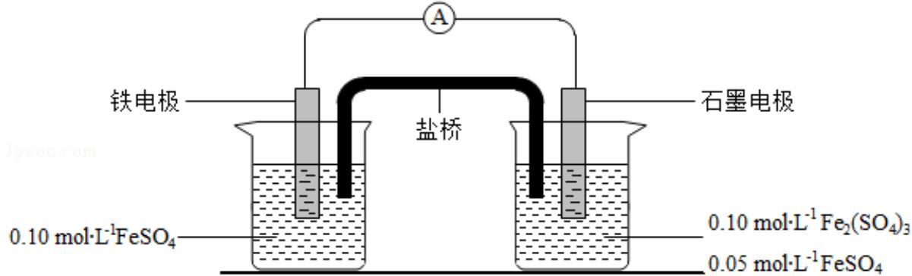

回答下列问题：

（1）由 $\mathrm { F e S O } _ { 4 } { \cdot } 7 \mathrm { H } _ { 2 } \mathrm { O }$ 固体配制 0.10mol•L﹣ $\mathrm { { } ^ { 1 } F e S O _ { 4 } }$ 溶液，需要的仪器有药匙、玻璃棒、托盘天平、烧杯、量筒　（从下列图中选择，写出名称）。

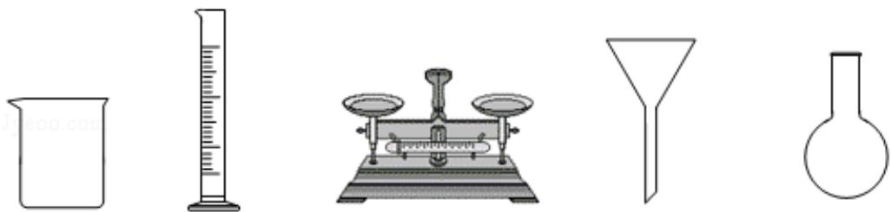

（2）电池装置中，盐桥连接两电极电解质溶液。盐桥中阴、阳离子不与溶液中的物质发生化学反应，并且电迁移率 $( \boldsymbol { \mathbf { u } } ^ { \infty } )$ 应尽可能地相近。根据下表数据，盐桥中应选择　KCl作为电解质。

<table><tr><td rowspan=1 colspan=1>阳离子</td><td rowspan=1 colspan=1> $\bf { u } ^ { \infty } \times 1 0 ^ { 8 } / \nabla \left( m ^ { 2 } \bullet _ { S } \cdot 1 { \bullet } V \right|$ -1)</td><td rowspan=1 colspan=1>阴离子</td><td rowspan=1 colspan=1> $\bf { u } ^ { \infty } \times 1 0 ^ { 8 } / \nabla \left( m ^ { 2 } \bullet _ { S } \cdot 1 { \bullet } V \right|$ -1)</td></tr><tr><td rowspan=1 colspan=1> $\mathrm { L i ^ { + } }$ </td><td rowspan=1 colspan=1>4.07</td><td rowspan=1 colspan=1> $\mathrm { H C O } _ { 3 }$ </td><td rowspan=1 colspan=1>4.61</td></tr><tr><td rowspan=1 colspan=1> $\mathrm { N a ^ { + } }$ </td><td rowspan=1 colspan=1>5.19</td><td rowspan=1 colspan=1> $\mathrm { N O } _ { 3 }$ </td><td rowspan=1 colspan=1>7.40</td></tr><tr><td rowspan=1 colspan=1> $\mathrm { C a } ^ { 2 + }$ </td><td rowspan=1 colspan=1>6.59</td><td rowspan=1 colspan=1>Cl⁻</td><td rowspan=1 colspan=1>7.91</td></tr><tr><td rowspan=1 colspan=1> $\mathrm { K } ^ { + }$ </td><td rowspan=1 colspan=1>7.62</td><td rowspan=1 colspan=1> $\mathrm { S O } _ { 4 } { } ^ { 2 }$ </td><td rowspan=1 colspan=1>8.27</td></tr></table>

（3）电流表显示电子由铁电极流向石墨电极。可知，盐桥中的阳离子进入　石墨　电极溶液中。

（4）电池反应一段时间后，测得铁电极溶液中 $\mathrm { ~ c ~ } \left( \mathrm { F e } ^ { 2 + } \right)$ 增加了 $0 . 0 2 \mathrm { m o l } { \cdot } \mathrm { L } ^ { \cdot 1 }$ ．石墨电极上未见Fe析出。可知，石墨电极溶液中 $\mathrm { ~ \bf ~ c ~ } ( \mathrm { F e } ^ { 2 + } ) = \mathrm { ~ \underline { { ~ 0 . 0 9 m o l / L } } ~ }$ 。

（5）根据（3）、（4）实验结果，可知石墨电极的电极反应式为 $\mathrm { F e } ^ { 3 + } { + } \mathbf { e } ^ { - } = \mathrm { F e } ^ { 2 + }$ ，铁电极反应式为 $ { \mathrm { F e } } - 2  { \mathrm { e } } ^ { - } =  { \mathrm { F e } } ^ { 2 + }$ 。因此，验证了 $\mathrm { F e } ^ { 2 + }$ 氧化性小于　Fe3+　，还原性小于Fe　。

（6）实验前需要对铁电极表面活化。在 $\mathrm { F e S O _ { 4 } }$ 溶液中加入几滴 $\mathrm { F e } _ { 2 } ~ ( \mathrm { S O } _ { 4 } )$ 3溶液，将铁电极浸泡一段时间，铁电极表面被刻蚀活化。检验活化反应完成的方法是　取少量活化液，加入洁净的试管中，向其中加入两滴硫氰酸钾溶液，看是否变红，若不变红，说明已经活化完成　。

【分析】（1）配制一定物质的量浓度的溶液用到的仪器有，托盘天平、烧杯、量筒、玻璃棒、容量瓶。

（2）盐桥中的离子不与溶液中的物质反应，排除了碳酸氢根离子和硝酸根离子，电迁移率尽可能的接近，硫酸根离子的电迁移率与其它离子的相差较大，KCl 的阴阳离子电迁移率相差最小；

（3）铁电极失去电子，铁电极是负极，石墨电极是正极，原电池内部阳离子向正极移动， 所以阳离子向石墨电极移动。

（4）铁电极反应： $\mathrm { F e } - 2 \mathrm { e } ^ { - } = \mathrm { F e } ^ { 2 + }$ ，铁电极增加0.02mol/L，根据电荷守恒，石墨电极反应 $\mathrm { F e } ^ { 3 + } { + } \mathbf { e } ^ { - } = \mathrm { F e } ^ { 2 + }$ ，则石墨电极增加 0.04 mol/L，原溶液是 0.05mol/L，现在变为 0.09$\mathrm { \ m o l / L }$ ；

（5）铁电极为负极，电极反应： $\mathrm { F e } - 2 \mathrm { e } ^ { - } = \mathrm { F e } ^ { 2 + }$ ，石墨电极为正极，电极反应反应： $\mathrm { F e } ^ { 3 ^ { + } + } { + \mathrm { e } }$ ${ \mathrm { \bar { \tau } } } = \mathrm { F e } ^ { 2 + }$ ，电池的总反应式为： $2 \mathrm { F e } ^ { 3 + } { + \mathrm { F e } } { = } 3 \mathrm { F e } ^ { 2 + }$ ，根据氧化剂的氧化性大于氧化产物，所以氧化性： $\mathrm { F e } ^ { 3 + } { > } \mathrm { F e } ^ { 2 + }$ ，同理还原性 $\mathrm { F e } > \mathrm { F e } ^ { 2 + }$

（6）对铁电极活化是除去表面的氧化膜，氧化膜反应完成后，铁单质把三价铁还原，所以只要检验溶液中是否还含有三价铁离子就可以了。

【解答】解析：（1）配制一定物质的量浓度的溶液用到的仪器有：托盘天平、烧杯、量筒、玻璃棒、容量瓶。图中给出的有托盘天平、烧杯、量筒；

故答案为：托盘天平、烧杯、量筒；

（2）盐桥中的离子不与溶液中的物质反应，排除了碳酸氢根离子和硝酸根离子，电迁移率尽可能的接近，故选KCl；

故答案为：KCl；

（3）铁电极失去电子，铁电极是负极，石墨电极是正极，原电池内部阳离子向正极移动，所以阳离子向石墨电极移动；

故答案为：石墨；

（4）铁电极反应： $\mathrm { F e } - 2 \mathrm { e } ^ { - } = \mathrm { F e } ^ { 2 + }$ ，铁电极增加 0.02mol/L，石墨电极反应 $\mathrm { F e } ^ { 3 + } { + \bf e } ^ { - } =$ $\mathrm { F e } ^ { 2 + }$ ，根据电荷守恒，则石墨电极增加 0.04 mol/L，变为 0.09 mol/L；

故答案为：0.09 mol/L；

（5）铁电极为负极，电极反应： $\mathrm { F e } - 2 \mathrm { e } ^ { - } = \mathrm { F e } ^ { 2 + }$ ，石墨电极为正极，电极反应反应： $\mathrm { F e } ^ { 3 ^ { + } + } { + \mathrm { e } }$ ${ \mathrm { \bar { \tau } } } = \mathrm { F e } ^ { 2 + }$ ，电池的总反应式为： $2 \mathrm { F e } ^ { 3 + } { + \mathrm { F e } } { = } 3 \mathrm { F e } ^ { 2 + }$ ；所以氧化性： $\mathrm { F e } ^ { 3 + } { > } \mathrm { F e } ^ { 2 + }$ ，还原性 $\mathrm { F e } >$ $\mathrm { F e } ^ { 2 + }$

故答案为： $\mathrm { F e } - 2 { \bf e } ^ { - } = \mathrm { F e } ^ { 2 + } ; \mathrm { F e } ^ { 3 + } + { \bf e } ^ { - } = \mathrm { F e } ^ { 2 + } ; \mathrm { F e } ^ { 3 + } ; \mathrm { F e } ;$

（6）对铁电极活化是除去表面的氧化膜，氧化膜反应完成后，铁单质把三价铁还原，所以只要检验溶液中是否还含有三价铁离子就可以了，取少量活化液，加入洁净的试管中，向其中加入两滴硫氰酸钾溶液，看是否变红，若不变红，说明已经活化完成。

故答案为：取少量活化液，加入洁净的试管中，向其中加入两滴硫氰酸钾溶液，看是否

变红，若不变红，说明已经活化完成。

【点评】本题考查了溶液的配制、原电池原理、氧化还原反应、电极方程式书写、离子的检验等知识点，属于学科内综合，考查分析问题，解决问题的能力，难度中等。

10．（14分）硫酸是一种重要的基本化工产品。接触法制硫酸生产中的关键工序是 $\mathrm { S O } _ { 2 }$ 的催化氧化： $\mathrm { S O } _ { 2 } \ \mathrm { ( } \mathbf { g ) } + \frac { 1 } { 2 } \mathrm { O } _ { 2 } \ \mathrm { ( } \mathbf { g ) }$ 钒催化剂 $\mathrm { S O _ { 3 } \ ( \underline { { { g } } } ) \ \triangle H = - 9 8 k J ^ { \bullet } m o l ^ { - 1 } }$ ．问答下列问题：

（1）钒催化剂参与反应的能量变化如图（a）所示， ${ \bf V } _ { 2 } { \bf O } _ { 5 } { \bf \Sigma } ( { \bf s } )$ 与 ${ \bf S } { \bf O } _ { 2 } \ \mathrm { ~ ( g ) }$ ）反应生成 $\mathrm { V O S O } _ { 4 }$ （s）和 ${ \bf V } _ { 2 } { \bf O } _ { 4 } \ { \bf \Gamma } ( { \bf s } )$ 的热化学方程式为： $2 \mathrm { V } _ { 2 } \mathrm { O } _ { 5 } \ldots ( \mathrm { ~ s ~ } ) + 2 \mathrm { S } \mathrm { O } _ { 2 } \ldots ( \mathrm { ~ g ~ } ) = 2 \mathrm { V } \mathrm { O } \mathrm { S } \mathrm { O } _ { 4 - } ( \mathrm { ~ s ~ } ) + \mathrm { V } _ { 2 } \mathrm { O } _ { 4 }$

（s） $\triangle \mathrm { H } = - 3 5 1 \mathrm { k J } { \cdot } \mathrm { m o l } ^ { - 1 }$

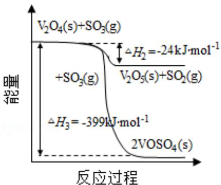  
图(a)

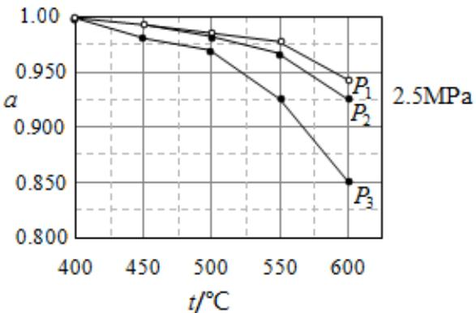  
图(b)

（2）当 ${ \bf S } { \bf O } _ { 2 } ~ ( \bf g ) , ~ { \bf O } _ { 2 } ~ ( \bf g )$ 和 ${ \bf N } _ { 2 } { \bf \Delta } ( \bf g )$ ）起始的物质的量分数分别为 7.5%、10.5%和 82%时，在 0.5MPa、2.5MPa 和 5.0MPa 压强下， $\mathrm { S O } _ { 2 }$ 平衡转化率 α 随温度的变化如图（b）所示。反应在 5.0MPa、550℃时的 $\alpha { = } \_ { 0 . 9 7 5 }$ ，判断的依据是　反应是气体分子数减小的反应，压强越大转化率越大　。影响α的因素有　压强、温度、投料比　。

（3）将组成（物质的量分数）为 $2 \mathrm { m } \% \mathrm { S O } _ { 2 } \mathrm { ( } \mathrm { g ) } , \mathrm { m } \% \mathrm { O } _ { 2 } \mathrm { ( } \mathrm { g ) }$ 和 ${ \bf q } ^ { 0 } / { \bf \Gamma } _ { 0 } \mathrm { N } _ { 2 } { \bf \Gamma } ( { \bf \Gamma } { \bf g } )$ 的气体通入反应器，在温度t、压强p条件下进行反应。平衡时，若 $\mathrm { S O } _ { 2 }$ 转化率为α，则 ${ \mathrm { S O } } _ { 3 }$ 压强为$\frac { 2 \mathfrak { a } _ { \mathfrak { m } } } { 1 0 0 - \mathfrak { a } _ { \mathfrak { m } } }$ ，平衡常数 $\mathrm { K _ { p } } \mathrm { = \_ } \mathrm { \_ } \mathrm { \frac { \mathfrak { a } } { \left( 1 \mathrm { - } \mathfrak { a } \ \right) ^ { 1 . 5 } ( \frac { \mathfrak { m } } { 1 \mathrm { 0 } \mathrm { 0 } \mathrm { - } \mathrm { \overline { { m } } } \mathfrak { a } } ^ { \mathrm { 0 } } ) ^ { 0 . 5 } } }$ （以分压表示，分压＝总压×物质的量分数）。

（4）研究表明， ${ \mathrm { S O } } _ { 2 }$ 催化氧化的反应速率方程为：v＝k $( \frac { a } { a ^ { \prime } } - 1 ) ^ { 0 . 8 } ( 1 - \mathrm { n } \alpha ^ { \prime } )$ ）式中：k 为反应速率常数，随温度 t 升高而增大；α 为 $\mathrm { S O } _ { 2 }$ 平衡转化率， $\alpha ^ { \prime }$ 为某时刻 $\mathrm { S O } _ { 2 }$ 转化率，n 为常数。在 $\alpha ^ { \prime } \mathrm { ~ } { } = 0 . 9 0$ 时，将一系列温度下的 k、α 值代入上述速率方程，得到v～t曲线，如图（c）所示。

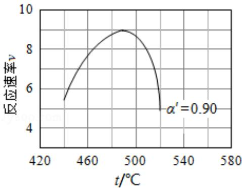  
图(c)

曲线上v最大值所对应温度称为该 $\alpha ^ { \prime }$ ′下反应的最适宜温度 $\mathrm { { t } _ { \mathrm { { m } } } . \partial \ t { < } \mathrm { { t } _ { \mathrm { { m } } } } }$ 时，v逐渐提高；t${ > } \mathrm { t _ { m } }$ 后，v 逐渐下降。原因是　反应温度升高，速率常数 k 增大使速率加快，但 α 降低造成速率v减小， $\underline { { \mathsf { t } } } { < } \mathbf { t } _ { \mathrm { m } }$ 时，k增大对v的提高大于α引起的降低； $\underline { { \boldsymbol { \mathrm { t } } > \boldsymbol { \mathrm { t } } _ { \mathrm { m } } } }$ 后，速率常数k增大小于α 引起的降低　。

【分析】（1）由图象得出 $\mathrm { ( 1 ) } \mathrm { V } _ { 2 } \mathrm { O } _ { 4 } \mathrm { ( \bf ~ s ) } + \mathrm { S } \mathrm { O } _ { 3 } \mathrm { ( \bf ~ g ) } = \mathrm { V } _ { 2 } \mathrm { O } _ { 5 } \mathrm { ( \bf ~ s ) } + \mathrm { S } \mathrm { O } _ { 2 } \mathrm { ( \bf ~ g ) } \bigtriangleup \mathrm { H } = - 2 4 \mathrm { k J } ^ { \bf { s } }$ $\mathrm { m o l ^ { - 1 } }$

$$
) \mathrm { V } _ { 2 } \mathrm { O } _ { 4 } \mathrm { ( \textbf { s ) } } + 2 \mathrm { S O } _ { 3 } \mathrm { ( \textbf { g ) } } = 2 \mathrm { V O S O } _ { 4 } \mathrm { ( \textbf { s ) } } \bigtriangleup \mathrm { H } = - 3 9 9 \mathrm { k J } ^ { \bullet } \mathrm { m o l } ^ { - 1 } ,
$$

结合盖斯定律可知 $\textcircled{2} - \textcircled{1} \times 2$ 得到： $2 \mathrm { V } _ { 2 } \mathrm { O } _ { 5 } \mathrm { ~ ( \bf ~ s ) ~ } + 2 \mathrm { S } \mathrm { O } _ { 2 } \mathrm { ~ ( \bf ~ g ) ~ } = 2 \mathrm { V O S O } _ { 4 } \mathrm { ~ ( \bf ~ s ) ~ } + \mathrm { V } _ { 2 } \mathrm { O } _ { 4 } \mathrm { ~ ( \bf ~ s ) } ;$ （2）当 ${ \bf S } { \bf O } _ { 2 } ~ ( \bf g ) , ~ { \bf O } _ { 2 } ~ ( \bf g )$ 和 ${ \bf N } _ { 2 } { \bf \Delta } ( \bf g )$ 起始的物质的量分数分别为 7.5%、10.5%和 82%时，在 0.5MPa、2.5MPa 和 5.0MPa 压强下， $\mathrm { S O } _ { 2 }$ 平衡转化率 α 随温度的变化如图（b）所示，这个 $\mathrm { S O } _ { 2 } \ \mathrm { ( } \mathbf { g ) } + \frac { 1 } { 2 } \mathrm { O } _ { 2 } \ \mathrm { ( } \mathbf { g ) }$ 钒催化剂 ${ \bf S O } _ { 3 } ~ ( \bf g )$ ）反应是气体分子数减小的反应，压强越大转化率越大，所以反应在 5.0MPa、550℃时的 $\alpha { = } 0 . 9 7 5$ ，由图象看出压强越大转化率越高，温度越高转化率越小，转化率与影响平衡的因素：温度压强还与投料比有关，氧气越多 $\mathrm { S O } _ { 2 }$ 平衡转化率α 越大；

（3）利用三段式计算出平衡时三氧化硫的量，利用阿伏伽德罗定律的推论压强之比等于物质的量的比，分压＝总压×物质的量分数可解；

（4） $\operatorname { v } = \mathrm { k } ( \frac { \ a } { \ a \ ^ { \prime } \ } - 1 ) \ ^ { 0 . 8 } ( 1 - \mathtt { n } \alpha ^ { \prime } )$ 温度升高，速率常数k增大，反应速率增大； $\mathrm { S O } _ { 2 }$ $\mathbf { \Sigma } ( \mathbf { g } ) \mathbf { \Sigma } + \frac { \mathbf { 1 } } { \mathbf { 2 } } \mathbf { O } _ { 2 } \mathbf { \Sigma } ( \mathbf { g } )$ 钒催化剂 $\mathrm { S O _ { 3 } \ ( \underline { { { g } } } ) \ \triangle H = - 9 8 k J ^ { \bullet } m o l ^ { - 1 } }$ ．为放热反应，平衡转化率 a 减小， $( \frac { a } { a ^ { \prime } } - 1 ) ^ { \ 0 . 8 }$ 减小，反应速率减小， $\mathrm { t } { < } \mathrm { t } _ { \mathrm { m } }$ 时，速率常数 k 增大，对速率的影响大于因 $( \frac { a } { a ^ { \prime } } - 1 ) ^ { 0 . 8 }$ 减小对速率的影响，总体速率加快； $\mathrm { { \ t { > } t _ { \mathrm { { m } } } } }$ 后速率常数k增大没有α减小对速率影响大，速率减小。

【解答】解：（1）由图象得出 $\mathrm { ( 1 ) } \mathrm { V } _ { 2 } \mathrm { O } _ { 4 } \mathrm { ( \bf s ) } + \mathrm { S } \mathrm { O } _ { 3 } \mathrm { ( \bf g ) } = \mathrm { V } _ { 2 } \mathrm { O } _ { 5 } \mathrm { ( \bf s ) } + \mathrm { S } \mathrm { O } _ { 2 } \mathrm { ( \bf g ) } \triangle \mathrm { H } = - 2 4 \mathrm { k J }$ $\cdot _ { \mathrm { m o l } ^ { - 1 } }$

$$
\textcircled { 2 } \mathrm { V } _ { 2 } \mathrm { O } _ { 4 } \mathrm { ( \textbf { s } ) } + 2 \mathrm { S } \mathrm { O } _ { 3 } \mathrm { ( \textbf { g } ) } = 2 \mathrm { V O S O } _ { 4 } \mathrm { ( \textbf { s } ) } \bigtriangleup \mathrm { H } = \mathrm { - } 3 9 9 \mathrm { k J } ^ { \bullet } \mathrm { m o l } ^ { - 1 } ,
$$

由盖斯定律可知 $\textcircled{2} - \textcircled{1} \times 2$ 得到： $2 \mathrm { V } _ { 2 } \mathrm { O } _ { 5 } \mathrm { ~ ( ~ s ~ ) ~ } + 2 \mathrm { S } \mathrm { O } _ { 2 } \mathrm { ~ ( ~ g ~ ) ~ } = 2 \mathrm { V O S O } _ { 4 } \mathrm { ~ ( ~ s ~ ) ~ } + \mathrm { V } _ { 2 } \mathrm { O } _ { 4 }$ （s）△$\mathrm { H } { = } \mathrm { ~ - ~ } 3 5 1 \mathrm { k J } { \bullet } \mathrm { m o l } ^ { - 1 }$ ；

故答案为： $\begin{array} { r } { 2 \mathrm { V } _ { 2 } \mathrm { O } _ { 5 } \mathrm { ( \textbf { s ) } } + 2 \mathrm { S } \mathrm { O } _ { 2 } \mathrm { ( \textbf { g } ) } = 2 \mathrm { V } \mathrm { O S O } _ { 4 } \mathrm { ( \textbf { s ) } } + \mathrm { V } _ { 2 } \mathrm { O } _ { 4 } \mathrm { ( \textbf { s ) } } \bigtriangleup \mathrm { H } = - 3 5 1 \mathrm { k J } ^ { \circ } \mathrm { m o l } ^ { - 1 } ; } \end{array}$

（2）当 ${ \bf S } { \bf O } _ { 2 } ~ ( \bf g ) , ~ { \bf O } _ { 2 } ~ ( \bf g )$ 和 ${ \bf N } _ { 2 } { \bf \Delta } ( \bf g )$ 起始的物质的量分数分别为 7.5%、10.5%和 82%时，在 0.5MPa、2.5MPa 和 5.0MPa 压强下， $\mathrm { S O } _ { 2 }$ 平衡转化率 α 随温度的变化如图（b）所示，这个 $\mathrm { S O } _ { 2 } \ \mathrm { ( } \mathbf { g ) } + \frac { 1 } { 2 } \mathrm { O } _ { 2 } \ \mathrm { ( } \mathbf { g ) }$ 钒催化剂 $S { \bf O } _ { 3 } \ \mathrm { ~ ( ~ g ~ ) ~ }$ 反应是气体分子数减小的反应，压强越大转化率越大，所以反应在 5.0MPa、 $5 5 0 \mathrm { ^ \circ C }$ 时的 $\alpha { = } 0 . 9 7 5$ ，由图象看出压强越大转化率越高，温度越高转化率越小，转化率与影响平衡的因素：温度、压强还与投料比有关，氧气越多 $\mathrm { S O } _ { 2 }$ 平衡转化率α 越大；

故答案为：0.975；该反应是气体分子数减小的反应，压强越大转化率越大， $\mathrm { { P } } _ { 1 } =$ 5.0MPa，该线 $5 5 0 \mathrm { ^ \circ C }$ 时的转化率为97.5%；压强、温度、投料比；

（3）根据体积之比等于物质的量的比， $2 \mathrm { m } \% + \mathrm { m } \% + \mathrm { q } \% = 1 0 0 \% 3 \mathrm { m } + \mathrm { p } = 1 0 0$ ，设 $\mathrm { S O } _ { 2 }$ 的物质的量为 $2 \mathbf { m } , \mathbf { \Lambda } { \cal O } _ { 2 }$ 的物质的量为m

$$
\mathrm { S O } _ { 2 } \mathrm { ( } \mathbf { g ) } + \frac { 1 } { 2 } \mathrm { O } _ { 2 } \mathrm { ( } \mathbf { g ) } \xrightarrow { \frac { \pm } { 2 } \pm \mathrm { [ } \pm \mathrm { / } \pm \mathrm { ( } \pm \mathrm { / } \pm \mathrm { ) } \pm \mathrm { ] } } \mathrm { S O } _ { 3 } \mathrm { ( } \mathbf { g ) }
$$

开始 2m m 0变化 α×2m α×m α×2m平衡 2m﹣α×2m m﹣α×m α×2m

反应后的总量： $2 \mathrm { m } \cdot \propto \times 2 \mathrm { m } \cdot \mathrm { m } \cdot \propto \times \mathrm { m } + \alpha \times 2 \mathrm { m } + \mathrm { q } = 3 \mathrm { m } + \mathrm { q } \cdot \alpha \mathrm { m }$ ，结合 $3 { \mathrm { m } } + { \mathrm { p } } = 1 0 0$ ，反应后的总量 $= 1 0 0 \textrm { - } \alpha \mathrm { m }$

$$
\frac { \mathbb { P } ( \mathbb { S } \mathbb { O } _ { 3 } ) } { \mathbb { P } } = \frac { { \mathrm { n } } ( \mathbb { S } \mathbb { O } _ { 3 } ) } { { \mathrm { n } } ( \breve { \Xi } _ { \mathrm { a } } ) } - \frac { 2 \mathbb { a } _ { \Re } } { 1 0 0 - \mathbb { a } _ { \Re } } , \mathbb { M } \mathbb { p } \ ( \mathbb { S } \mathbf { O } _ { 3 } ) \ = \frac { 2 \mathbb { G } _ { \ I I D } } { 1 0 0 - \mathbb { a } _ { \ I I } } ,
$$

$$
\mathrm { \begin{array} { r l r l r l } { \mathrm { \mathit { \Sigma } } ^ { \mathrm { S F } } } & { \mathrm { \mathit { \Sigma } } ^ { \mathrm { S F } } } & { \mathrm { \mathit { \Sigma } } ^ { \mathrm { S F } } } & { \mathrm { \mathit { \Sigma } } ^ { \mathrm { S F } } } & { \mathrm { \mathit { \Sigma } } ^ { \mathrm { S F } } } & { = } & { \frac { \mathrm { \Delta } \mathrm { \ n } \mathrm { \Sigma } \mathrm { \Lambda } _ { 3 } } { \mathrm { P } ( { \mathrm { S O } _ { 2 } } ) \mathrm { P } ^ { 0 . 5 } ( \mathrm { \bar { O } } _ { 2 } ) } = } & { \frac { \frac { 2 \mathrm { \ : \mathrm { G } } _ { \mathrm { I m } } } { 1 0 0 - \mathrm { \ : G } _ { \mathrm { I m } } } \mathrm { \Delta } \mathrm { \Lambda } ^ { \mathrm { p } } } { \frac { \mathrm { \Delta } \mathrm { \Sigma } \mathrm { \Sigma } \mathrm { \Sigma } \mathrm { G } _ { \mathrm { I m } } } { 1 0 0 - \mathrm { \ : G } _ { \mathrm { I m } } } \mathrm { \Delta } \mathrm { \Lambda } ^ { \mathrm { p } } \mathrm { \overline { { ( \mathrm { \Lambda } } \mathrm { { \Sigma } } \mathrm { \mathrm { - } } \mathrm { \bar { G } } _ { \mathrm { I m } } ) \mathrm { \Lambda } } ^ { 0 . 5 } } } = } \end{array} }
$$

$$
\frac { a } { ( 1 - a ) ^ { 1 . 5 } ( \frac { \pi } { 1 0 0 - \pi ^ { a } } ^ { p } ) ^ { 0 . 5 } } ,
$$

故答案为： $\frac { 2 a _ { \mathrm { m p } } } { 1 0 0 - \mathrm { { G } _ { m } } } : = \frac { \alpha } { ( 1 - \alpha ) ^ { 1 . 5 } ( \frac { \pi } { 1 0 0 - \pi ^ { \alpha } } \gamma ) ^ { 0 . 5 } } ;$

（4） $\operatorname { v } = \mathrm { k } ( \frac { \ a } { \ a \ ^ { \prime } \ } - 1 ) \ ^ { 0 . 8 } ( 1 - \mathtt { n } \alpha ^ { \prime } )$ 温度升高，表达式中速率常数 k 增大，反应速率增大； $\mathrm { S O } _ { 2 } \ \mathrm { ( } \mathbf { g ) } + \frac { 1 } { 2 } \mathrm { O } _ { 2 } \ \mathrm { ( } \mathbf { g ) }$ 钒催化剂 $\mathrm { S O _ { 3 } \ ( \ g ) } \ \triangle \mathrm { H } = \mathrm { ~ - ~ } 9 8 \mathrm { k J } { \cdot } \mathrm { m o l } ^ { - 1 }$ ，为放热反应，平衡转化率 α 减小， $( \frac { a } { a ^ { \prime } } - 1 ) ^ { 0 . 8 }$ 减小，反应速率减小， $\mathrm { t } { < } \mathrm { t } _ { \mathrm { m } }$ 时，速率常数 k 增大，对速率的影响大于因 $( \frac { a } { a ^ { \prime } } - 1 ) ^ { \ 0 . 8 }$ 减小对速率的影响，总体速率加快； $\mathrm { { \ t { > } t _ { \mathrm { { m } } } } }$ 后速率常数k增大没有α 减小对速率影响大，速率减小。

故答案为：反应温度升高，速率常数k增大使速率加快，但α 降低造成速率v减小。 $\mathfrak { t } <$ $\mathbf { t _ { m } }$ 时，k增大对v的提高大于α引起的降低； $\mathrm { { \ t { > } t _ { \mathrm { { m } } } } }$ 后，速率常数k增大小于α引起的降低。

【点评】本题考查了热化学方程式的书写，平衡转化率、压强平衡常数等知识点，情景陌生，要好好利用图象，考查分析问题的能力，计算能力，难度较大。

## （二）选考题：共 15分。请考生从 2道化学题中任选一题作答。如果多做，则按所做的第一题计分。[化学--选修 3：物质结构与性质]（15分）

11．（15 分）Goodenough 等人因在锂离子电池及钴酸锂、磷酸铁锂等正极材料研究方面的卓越贡献而获得2019年诺贝尔化学奖。回答下列问题：

（1）基态 $\mathrm { F e } ^ { 2 + }$ 与 $\mathrm { F e } ^ { 3 + }$ 离子中未成对的电子数之比为　4：5　。

（2）Li及其周期表中相邻元素的第一电离能 $\left( \mathrm { I } _ { 1 } \right)$ 如表所示。 $\mathrm { I } _ { 1 } \ \mathrm { ( L i ) } \ \mathrm { > I } _ { 1 } \ \mathrm { ( N a ) }$ ），原因是 $\mathrm { L i } \stackrel {  } { \partial } \mathrm { N a }$ 同族，Na 电子层多，原子半径大，易失电子　。 $\mathrm { I } _ { 1 } ~ \left( \mathrm { B e } \right) > \mathrm { I } _ { 1 } ~ \left( \mathrm { B } \right) > \mathrm { I } _ { 1 }$ （Li），原因是　Li、Be、B 同周期，核电荷数依次增加，Be 的电子排布为： $1 \mathrm { s } ^ { 2 } 2 \mathrm { s } ^ { 2 } ;$ ，全满稳定结构，第一电离能最大，与Li相比，B的核电荷数大，半径小，较难失去电子，第一电离能较大。　。

<table><tr><td colspan="3"> $\mathrm { I } _ { 1 } / \ \mathrm { ( k J } { \cdot } \mathrm { m o l } ^ { - 1 } \mathrm { ) }$ </td></tr><tr><td>Li 520</td><td>Be 900</td><td>B 801</td></tr></table>

<table><tr><td rowspan=1 colspan=1>Mg738</td><td rowspan=1 colspan=1>Al578</td></tr></table>

（3）磷酸根离子的空间构型为　正四面体形　，其中 P 的价层电子对数为　4　、杂化轨道类型为 $\underline { { \mathsf { s p } ^ { 3 } } }$ 。

（4） ${ \mathrm { L i F e P O } } _ { 4 }$ 的晶胞结构示意图如（a）所示。其中O围绕Fe和P分别形成正八面体和正四面体，它们通过共顶点、共棱形成空间链结构。每个晶胞中含有 $\mathrm { L i F e P O _ { 4 } }$ 的单元数有　4　个。

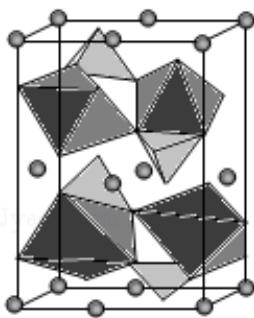  
(a) $\mathtt { L i F e P O 4 }$

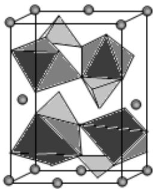  
(b)Li1\_xFePO4

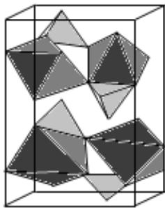  
(c) $\tt F e P O _ { 4 }$

电池充电时， ${ \mathrm { L i F e P O } } _ { 4 }$ 脱出部分Li+，形成 $_ { \mathrm { L i _ { 1 } - x } } \mathrm { F e P O _ { 4 } }$ ，结构示意图如（b）所示，则 $\mathbf { X } =$ ${ \frac { 3 } { 1 6 } } \mathrm { { \_ } } { \mathrm { ~ n ~ } } ( \mathrm { F e } ^ { 2 + } ) \colon { \mathfrak { n } } \ ( \mathrm { F e } ^ { 3 + } ) \ = \underline { { { \ } 1 3 \colon 3 } } \quad$

【分析】（1）基态 Fe 的电子排布式为： $\mathrm { 1 s ^ { 2 } 2 s ^ { 2 } 2 p ^ { 6 } 3 s ^ { 2 } 3 p ^ { 6 } 3 d ^ { 6 } 4 s ^ { 2 } }$

（2）Li与Na 同族，Na电子层多，原子半径大，易失电子；Be、B、Li的价电子排布分别为： $2 \mathrm { s } ^ { 2 } , ~ 2 \mathrm { s } ^ { 2 } 2 \mathrm { p } ^ { 1 } , ~ 2 \mathrm { s } ^ { 1 }$

（3）根据价层电子对互斥理论，价层电子对数＝杂化轨道数 $= \sigma + \frac { 1 } { 2 } \ ( \mathbf { a } - \mathbf { x } \mathbf { b } )$ ），若为阴离子，a＝价电子数+电荷数；价层电子对数＝4，空间构型为四面体形，去掉孤电子对，即为分子的空间构型；杂化轨道数＝4，为 $\mathsf { s p } ^ { 3 }$ 杂化；

（4）根据晶胞中的正八面体和正四面体来判断； ${ \mathrm { L i F e P O } } _ { 4 }$ 失去的 Li+为：棱心上一个，面心上一个；化合物中正负化合价代数和等于 0。

【解答】解：（1）基态Fe的电子排布式为： $\mathrm { 1 s ^ { 2 } 2 s ^ { 2 } 2 p ^ { 6 } 3 s ^ { 2 } 3 p ^ { 6 } 3 d ^ { 6 } 4 s ^ { 2 } }$ ，基态Fe失去最外层2个电子得 $\mathrm { F e } ^ { 2 + }$ ，价电子排布为： $3 \mathrm { d } ^ { 6 }$ ，基态 Fe 失去 3 个电子得 $\mathrm { F e } ^ { 3 + }$ ，价电子排布为：$3 \mathrm { d } ^ { 5 }$ ，根据洪特规则和泡利原理，d 能级有 5 个轨道，每个轨道最多容纳 2 个电子， $\mathrm { F e } ^ { 2 + }$ 有4个未成对电子， $\mathrm { F e } ^ { 3 \mathrm { + } }$ 有5个未成对电子，所以未成对电子数之比为：4：5，

故答案为：4：5；

（2）Li与Na 同族，Na电子层多，原子半径大，易失电子；Li、Be、B的电子排布分别为： $\mathrm { 1 s ^ { 2 } 2 s ^ { 1 } , ~ 1 s ^ { 2 } 2 s ^ { 2 } , ~ 1 s ^ { 2 } 2 s ^ { 2 } 2 p ^ { 1 } }$ ，Li、Be、B同周期，核电荷数依次增加，Be的电子排布为： $1 \mathrm { s } ^ { 2 } 2 \mathrm { s } ^ { 2 }$ ，全满稳定结构，第一电离能最大，与 Li 相比 B 的核电荷数大，半径小，较难失去电子，第一电离能较大，

故答案为：Li 与 $\mathrm { N a }$ 同族，Na 电子层多，原子半径大，易失电子；Li、Be、B 同周期，核电荷数依次增加，Be的电子排布为： $1 \mathrm { s } ^ { 2 } 2 \mathrm { s } ^ { 2 }$ ，全满稳定结构，第一电离能最大，与Li相比，B 的核电荷数大，半径小，较难失去电子，第一电离能较大；

（3）根据价层电子对互斥理论， $\mathrm { P O } _ { 4 } { } ^ { 3 \mathrm { ~ - ~ } }$ 离子的价层电子对数： $4 + \frac { 1 } { 2 } ( 5 + 3 - 4 \times 2 ) = 4 + 0 =$ 4，VSEPR构型为：四面体形，去掉孤电子对数 0，即为分子的立体构型，即正四面体形；杂化轨道数＝价层电子对数＝4，中心原子P的杂化类型为： $\mathsf { s p } ^ { 3 }$ 杂化；

$$
\mathsf { s p } ^ { 3 }
$$

（4）根据晶胞中的正八面体和正四面体，可知晶体中含有4个单元 ${ \mathrm { L i F e P O } } _ { 4 }$ ；由图可知圆球为 Li+， ${ \mathrm { L i F e P O } } _ { 4 }$ 失去的Li+为：棱心上一个，面心上一个；棱心上的为该晶胞的 $\frac { 1 } { 4 }$ 面心上为该晶胞的 $\frac { 1 } { 2 }$ ；因晶体中含有4个单元 $\mathrm { L i F e P O _ { 4 } }$ ，所以 $\scriptstyle \mathbf { x } = { \frac { 1 } { 4 } } \times { \frac { 1 } { 4 } } + { \frac { 1 } { 2 } } \times { \frac { 1 } { 4 } } = { \frac { 3 } { 1 6 } } ,$ 则 $1 - \mathbf { x } = 1 - { \frac { 3 } { 1 6 } } = { \frac { 1 3 } { 1 6 } }$ ，所以化学式为 $\mathrm { L i } _ { 1 3 } \mathrm { F e P O } _ { 4 }$ ，根据化合价代数和等于0，设 $\mathrm { F e } ^ { 2 + }$ 的个数为 x， $\mathrm { F e } ^ { 3 + }$ 的的个数为 y， $\frac { 1 3 } { 1 6 } + 2 x + 3 y + 5 = 8$ ，又因 $\mathbf { x } + \mathbf { y } = 1$ ，解得 $\mathrm { { x } = { \frac { 1 3 } { 1 6 } } , \ \mathrm { { y } = { \frac { 3 } { 1 6 } } } }$ 所以个数比为13：3，

$$
4 ; ~ \frac { 3 } { 1 6 } ; ~ 1 3 : ~ 3
$$

【点评】本题考查学生对原子结构和性质的理解和掌握，题目难度中等，掌握常见的基态原子的电子排布、第一电离能、杂化方式、晶胞的计算等，明确原子杂化原理和晶胞计算方法是解题关键。阅读题目获取新信息能力等，需要学生具备扎实的基础与综合运用知识、信息分析解决问题能力。

## [化学--选修 5：有机化学基础]（15 分）

12．有机碱，例如二甲基胺（ ）、苯胺 -NH2 ）、吡啶 （ ）等，在有机合成中应用很普遍，目前“有机超强碱”的研究越来越受到关注。以下为有机超强碱 F

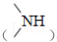

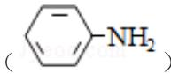

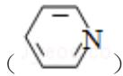

的合成路线：

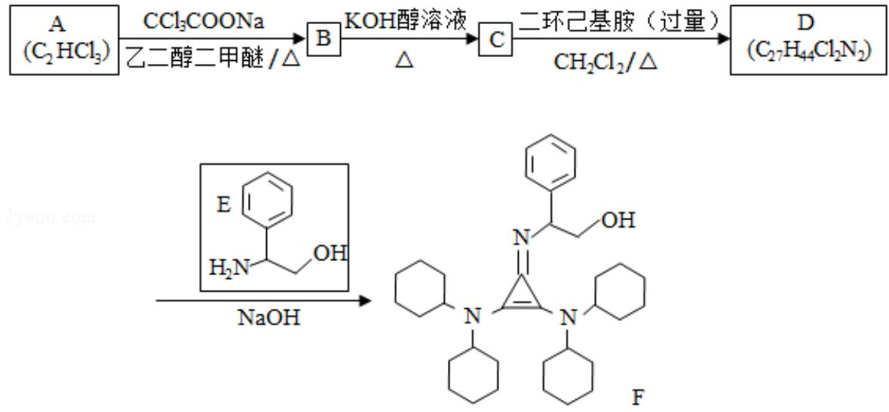

已知如下信息：

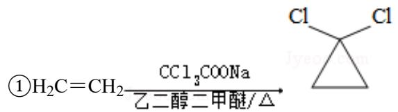

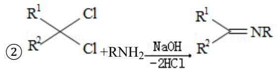

③苯胺与甲基吡啶互为芳香同分异构体

回答下列问题：

（1）A 的化学名称为　三氯乙烯　。

（ 2 ） 由 B 生 成 C 的 化 学 方 程 式 为

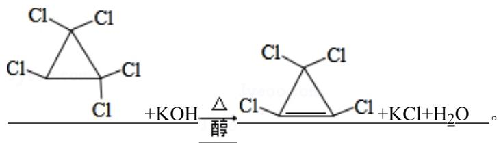

（3）C 中所含官能团的名称为　碳碳双键、氯原子　。

（4）由C 生成D的反应类型为　取代反应　。

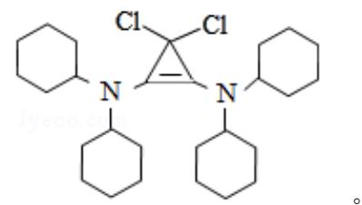

（5）D 的结构简式为

（6）E 的六元环芳香同分异构体中，能与金属钠反应，且核磁共振氢谱有四组峰，峰面

积之比为6：2：2：1的有　6　种，其中，芳香环上为二取代的结构简式为 OH

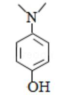

【分析】 $\textbf { A } \left( \mathbf { C } _ { 2 } \mathbf { H C l } _ { 3 } \right)$ 三氯乙烯在 $\mathrm { C C l _ { 3 } C O O N a }$ 和乙二醇二甲醚在加热条件下生成 B，

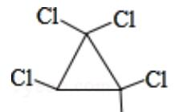

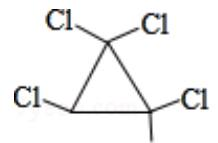

即 B 为 ，B（ ）在 KOH 的醇溶液下加热发生消去反应，

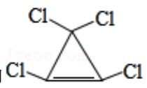

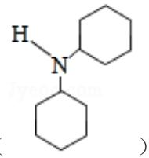

$$
\mathrm { C H } _ { 2 } \mathrm { C l } _ { 2 }
$$

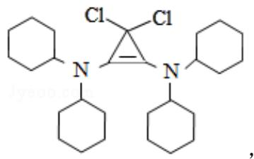

条 件 下 发 生 取 代 反 应 生 成 D ， 即

D

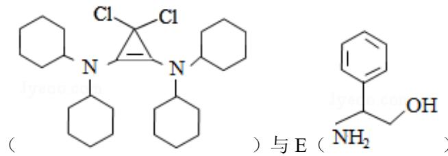

）在NaOH条件下反应生成最终产物

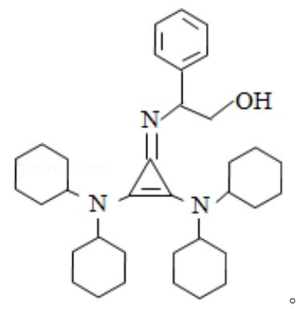

F：

【解答】解：（1） $\textbf { A } ( \mathbf { C } _ { 2 } \mathrm { H C l } _ { 3 } )$ 名称为三氯乙烯，

故答案为：三氯乙烯；

（2）有分析得出，由B 发生消去反应生成C的化学方程式为：

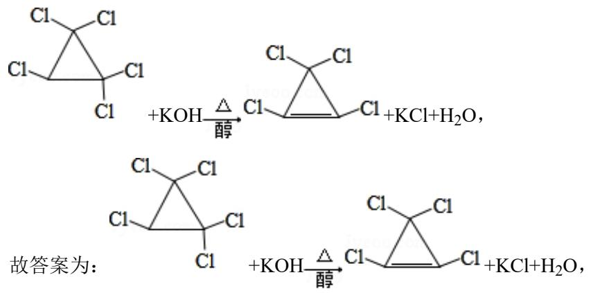

（3）C 中的官能团为：碳碳双键、氯原子，

故答案为：碳碳双键、氯原子；

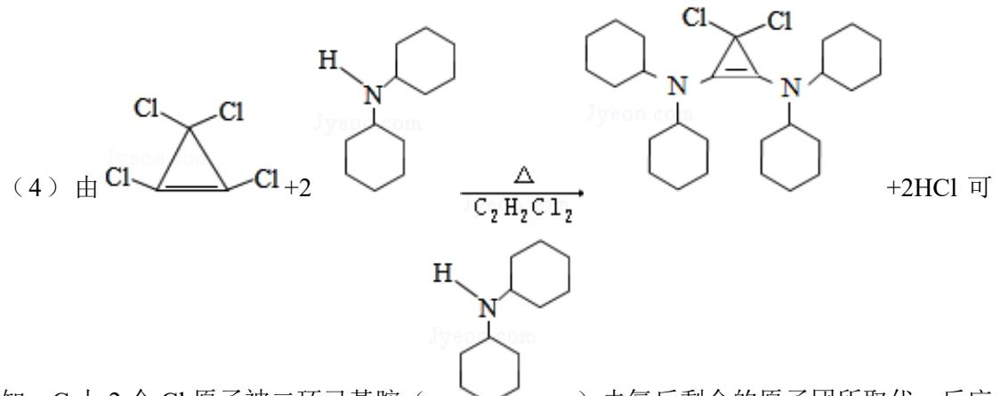

知，C 上 2 个 Cl 原子被二环己基胺（ ）去氢后剩余的原子团所取代，反应类型为：取代反应，

故答案为：取代反应；

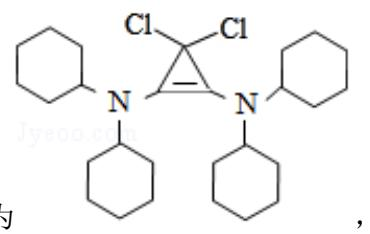

（5）D 的结构简式为

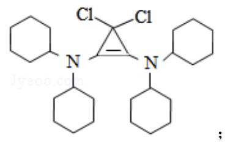

故答案为：

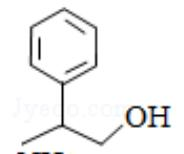

（6）E（ ）的六元环芳香同分异构体中，与钠反应产生氢气，说明含有羟

基，且核磁共振氢谱有四组峰，峰面积之比为6：2：2：1；说明有两个甲基且对称；又

因苯胺与甲基吡啶互为芳香同分异构体，所以同分异构体的结构简式分别为：

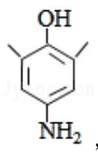

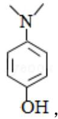

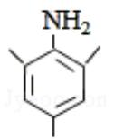

OH

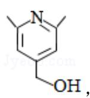

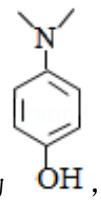

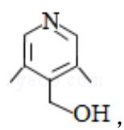

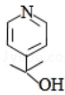

共 6 种，其中，芳香环上为二

取代的结构简式为 ，

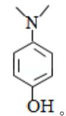

故答案为：6； 。

【点评】本题考查学生对有机化学基础的理解和掌握，题目难度中等，掌握有机的命名、反应类型、化学反应原理、同分异构等，明确化学反应及同分异构的书写是解题关键。同时考查了阅读题目获取新信息的能力，需要学生具备扎实的基础与综合运用知识、信息分析解决问题能力。